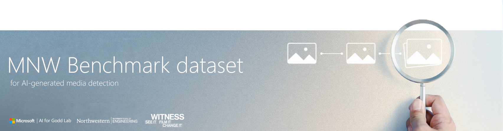

<div align="center"> 
<font size="6"><b>MNW Benchmark Dataset</b></font>
<br>
</div>


## 📣 Announcements

### V 1.0

- We have....


## 👋 Welcome to MNW Benchmark Dataset
This repository will contain the MNW dataset (*Microsoft-Northwestern-Witness*) and/or associated code for benchmarking AI-detection models across images, video, and audio.


## :fountain_pen: Cite us!
We have recently published a [summary paper on MNW](https://arxiv.org/abs/...). Please feel free to cite us!

```
@misc{MNW2025,
      title={MNW AI detection evaluation set}, 
      author={Thomas Roca and Marco Postiglione and Shirin Anlen and Zuzanna Wojciak and Masah Alimardani and Kevin White and Juan Lavista and V.S. Subrahmanian and Sam Gregory},
      year={2025},
      eprint={......},
      archivePrefix={arXiv},
}
```

## 🤝 Existing Collaborators and Contributors
